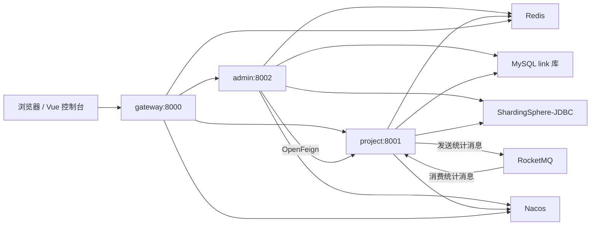

# LinkSwift 短链接系统

LinkSwift 是一个基于 Spring Boot、Spring Cloud Alibaba 和 Vue 3 的短链接服务项目，核心能力是将长链接转换为短链接，并围绕短链接提供分组管理、回收站、访问跳转、访问统计、批量创建、二维码展示等功能。

项目后端采用多模块 Maven 结构，拆分为网关服务、管理服务和短链核心服务；前端位于 `console-vue`，提供短链控制台页面。

## 项目定位

本项目适合学习或二次开发以下方向：

- 短链接生成、跳转、缓存和防穿透设计
- Spring Cloud Gateway 网关鉴权和请求头透传
- Nacos 服务发现、OpenFeign 服务间调用
- Redis 缓存、分布式锁、布隆过滤器、访问风控、UV/UIP 去重
- RocketMQ 异步统计写入和消息幂等
- ShardingSphere-JDBC 分表、数据加密
- Sentinel 接口限流和自定义限流返回
- Vue 3 + Element Plus + ECharts 控制台页面

## 技术栈

### 后端

- Java 17
- Spring Boot 3.0.7
- Spring Cloud 2022.0.3
- Spring Cloud Alibaba 2022.0.0.0-RC2
- Spring Cloud Gateway
- Spring Cloud OpenFeign
- Nacos Discovery
- MyBatis-Plus 3.5.3.1
- ShardingSphere-JDBC 5.3.2
- MySQL
- Redis / Redisson
- RocketMQ
- Sentinel
- Hutool
- Fastjson2
- Jsoup
- EasyExcel
- Thymeleaf

### 前端

- Vue 3
- Vue Router
- Vuex
- Element Plus
- Axios
- ECharts
- SortableJS
- QRCode
- Three.js / Vanta

说明：当前仓库的 `console-vue` 目录缺少 `package.json` / `vite.config.*` 等前端工程配置文件，前端源码存在，但无法仅凭当前仓库直接执行 `pnpm install` 或 `pnpm dev`。

## 仓库结构

```text
.
├── pom.xml                         # Maven 父工程
├── README.md                       # 项目说明文档
├── admin                           # 后台管理服务，端口 8002
│   ├── pom.xml
│   └── src/main
│       ├── java/com/nageoffer/shortlink/admin
│       │   ├── common              # 通用返回、异常、用户上下文、风控过滤器
│       │   ├── config              # 数据源、布隆过滤器、用户过滤器配置
│       │   ├── controller          # 用户、分组、短链、回收站、统计接口
│       │   ├── dao                 # 用户和分组数据访问
│       │   ├── dto                 # 管理端请求/响应对象
│       │   ├── remote              # Feign 调用 project 服务
│       │   ├── service             # 用户、分组、回收站业务
│       │   └── toolkit             # Excel 导出、随机 gid 生成
│       └── resources
│           ├── application.yml
│           ├── shardingsphere-config-dev.yml
│           ├── shardingsphere-config-prod.yml
│           └── lua/user_flow_risk_control.lua
├── project                         # 短链核心服务，端口 8001
│   ├── pom.xml
│   └── src/main
│       ├── java/com/nageoffer/shortlink/project
│       │   ├── common              # 通用返回、异常、Redis Key、MQ 常量
│       │   ├── config              # 数据源、Sentinel、布隆过滤器配置
│       │   ├── controller          # 短链、统计、回收站、URL 标题接口
│       │   ├── dao                 # 短链和统计数据访问
│       │   ├── dto                 # 核心服务请求/响应对象
│       │   ├── mq                  # RocketMQ 生产者/消费者、幂等处理
│       │   ├── service             # 短链创建、跳转、统计、回收站逻辑
│       │   └── toolkit             # Hash/Base62、链接工具
│       └── resources
│           ├── application.yml
│           ├── mapper/LinkMapper.xml
│           ├── shardingsphere-config-dev.yml
│           ├── shardingsphere-config-prod.yml
│           └── templates/notfound.html
├── gateway                         # Spring Cloud Gateway 网关，端口 8000
│   ├── pom.xml
│   └── src/main
│       ├── java/com/nageoffer/shortlink/gateway
│       │   ├── config
│       │   ├── dto
│       │   └── filter              # TokenValidate 网关过滤器
│       └── resources/application.yml
└── console-vue                     # Vue 3 控制台源码
    ├── README.md
    ├── index.html
    └── src
        ├── api                     # Axios 与接口模块
        ├── assets                  # 图标、图片、样式
        ├── components              # 通用组件
        ├── router                  # 前端路由
        ├── store                   # Vuex
        └── views                   # 登录、空间、回收站、个人中心页面
```

## 后端模块说明

### gateway

网关服务负责统一入口和 token 校验，默认端口为 `8000`。

主要代码：

- `GatewayServiceApplication`：网关启动类
- `TokenValidateGatewayFilterFactory`：读取请求头 `username`、`token`，到 Redis 校验 `short-link:login:{username}` 登录态
- `application.yml`：配置两条路由
  - `/api/short-link/admin/**` 转发到 `short-link-admin`
  - `/api/short-link/**` 转发到 `short-link-project`

白名单包括：

- `/api/short-link/admin/v1/user/login`
- `/api/short-link/admin/v1/user/has-username`
- `POST /api/short-link/admin/v1/user`

鉴权通过后，网关会将 `userId`、`realName` 等用户信息写入请求头，供下游服务使用。

### admin

后台管理服务负责用户、分组、控制台入口聚合，默认端口为 `8002`。

主要职责：

- 用户注册、登录、退出、用户资料查询和修改
- 用户默认分组创建
- 短链接分组新增、修改、删除、排序
- 通过 Feign 调用 `project` 服务完成短链创建、批量创建、分页查询、统计查询、回收站操作
- 批量创建短链接后通过 EasyExcel 导出结果
- 基于 Redis + Lua 实现用户级访问频率限制

关键代码：

- `UserController` / `UserServiceImpl`
- `GroupController` / `GroupServiceImpl`
- `ShortLinkController`
- `RecycleBinController`
- `ShortLinkStatsController`
- `ShortLinkActualRemoteService`
- `UserTransmitFilter`
- `UserFlowRiskControlFilter`

### project

短链核心服务负责短链生命周期和访问统计，默认端口为 `8001`。

主要职责：

- 短链接创建、批量创建、修改、分页查询
- 短链接跳转原始链接
- 短链接回收站保存、恢复、移除
- 单链接和分组维度统计查询
- 访问日志、PV、UV、UIP、地域、浏览器、系统、设备、网络类型统计
- 获取原始 URL 的网页标题和 favicon
- 使用 Redis 缓存跳转关系，使用布隆过滤器降低数据库穿透
- 使用 RocketMQ 异步消费访问统计

关键代码：

- `ShortLinkController`
- `ShortLinkServiceImpl`
- `ShortLinkStatsCotroller`
- `ShortLinkStatsServiceImpl`
- `RecycleBinController`
- `RecycleBinServiceImpl`
- `UrlTitleController`
- `ShortLinkStatsSaveProducer`
- `ShortLinkStatsSaveConsumer`
- `DelayShortLinkStatsConsumer`
- `MessageQueueIdempotentHandler`
- `HashUtil`
- `LinkUtil`

## 架构概览



## 核心业务流程

### 用户登录和鉴权

1. 用户通过 `admin` 登录接口提交用户名和密码。
2. `UserServiceImpl` 校验用户后生成 token。
3. 登录态以 Redis Hash 形式保存：

```text
key   = short-link:login:{username}
field = token
value = 用户信息 JSON
ttl   = 30 分钟
```

4. 前端后续请求携带 `username` 和 `token` 请求头。
5. `gateway` 的 `TokenValidateGatewayFilterFactory` 校验 Redis 登录态。
6. 鉴权通过后转发到下游服务。

### 短链接创建

1. 控制台请求 `admin` 的短链创建接口。
2. `admin` 通过 `ShortLinkActualRemoteService` 调用 `project`。
3. `project` 使用原始链接追加 UUID 后进行 MurmurHash。
4. 将 hash 值转换为 Base62 字符串，作为短链后缀。
5. 通过 Redisson 布隆过滤器判断短链是否可能已存在。
6. 写入短链主表 `t_link` 和跳转表 `t_link_goto`。
7. 将 `fullShortUrl -> originUrl` 写入 Redis：

```text
short-link:goto:{fullShortUrl}
```

8. 返回完整短链接。

### 短链接跳转

1. 用户访问 `GET /{short-uri}`。
2. `ShortLinkServiceImpl.restoreUrl` 拼接当前域名和短链后缀得到 `fullShortUrl`。
3. 优先查询 Redis 跳转缓存。
4. 缓存命中时直接记录访问统计并重定向到原始链接。
5. 缓存未命中时先查布隆过滤器。
6. 布隆过滤器判断不存在时跳转到 `notfound` 页面。
7. 可能存在时加分布式锁查询数据库，回填 Redis 后重定向。
8. 每次有效访问都会生成统计记录并投递到 RocketMQ。

### 访问统计

统计采集包含：

- PV：页面访问次数
- UV：基于 `uv` Cookie 和 Redis Set 去重
- UIP：基于真实 IP 和 Redis Set 去重
- 浏览器、操作系统、设备类型、网络类型
- 国内地域信息，高德 IP 定位接口
- 小时、星期、日期维度访问趋势
- 高频访问 IP
- 新老访客访问记录

写入流程：

1. 跳转请求中构造 `ShortLinkStatsRecordDTO`。
2. `ShortLinkStatsSaveProducer` 投递 RocketMQ 消息。
3. `ShortLinkStatsSaveConsumer` 消费消息。
4. `MessageQueueIdempotentHandler` 使用 Redis 标记消息处理中/已完成。
5. 消费者写入访问统计表、访问日志表，并回写短链累计 PV/UV/UIP。
6. 如果短链正在迁移分组，消费者会将统计数据放入 Redisson 延迟队列稍后重试。

### 分组和回收站

- 用户注册后会自动创建一个默认分组。
- 分组支持新增、改名、删除、排序，并限制最大数量，默认 `20`。
- 短链接可以移动到回收站、从回收站恢复、从回收站移除。
- 短链分组迁移时会使用 Redisson 读写锁，避免访问统计和分组变更并发写入冲突。

## 数据库与分表

当前仓库没有提交数据库建表 SQL，需要根据实体类和 ShardingSphere 配置自行准备 `link` 数据库和相关表。

默认开发环境数据库连接位于：

- `admin/src/main/resources/shardingsphere-config-dev.yml`
- `project/src/main/resources/shardingsphere-config-dev.yml`

默认配置：

```yaml
jdbcUrl: jdbc:mysql://127.0.0.1:3306/link
username: root
password: toor
```

### admin 分表

`admin` 使用 ShardingSphere 对以下表做 16 分片：

- `t_user_${0..15}`：按 `username` 分片
- `t_group_${0..15}`：按 `username` 分片

同时对 `t_user.phone`、`t_user.mail` 配置 AES 加密。

### project 分表

`project` 使用 ShardingSphere 对以下表做 16 分片：

- `t_link_${0..15}`：按 `gid` 分片
- `t_link_goto_${0..15}`：按 `full_short_url` 分片
- `t_link_stats_today_${0..15}`：按 `gid` 分片

以下统计表在实体中以逻辑表名出现，当前配置未声明分片规则：

- `t_link_access_logs`
- `t_link_access_stats`
- `t_link_browser_stats`
- `t_link_device_stats`
- `t_link_locale_stats`
- `t_link_network_stats`
- `t_link_os_stats`

## Redis Key 设计

常见 Redis Key：

```text
short-link:login:{username}                 # 用户登录态
short-link:lock_user-register:{username}    # 用户注册锁
short-link:lock_group-create:{username}     # 分组创建锁
short-link:goto:{fullShortUrl}              # 短链跳转缓存
short-link:is-null:goto_{fullShortUrl}      # 空值缓存，防缓存穿透
short-link:lock:goto:{fullShortUrl}         # 跳转回源锁
short-link:lock:update-gid:{fullShortUrl}   # 分组迁移读写锁
short-link:stats:uv:{fullShortUrl}          # UV 去重 Set
short-link:stats:uip:{fullShortUrl}         # UIP 去重 Set
short-link:idempotent:{messageId}           # MQ 消费幂等标识
short-link:delay-queue:stats                # 延迟统计队列
short-link:user-flow-risk-control:{username}# 用户访问风控计数
```

Redisson 布隆过滤器：

- `userRegisterCachePenetrationBloomFilter`：用户注册/用户名检查防穿透
- `shortUriCreateCachePenetrationBloomFilter`：短链生成和访问防穿透

## RocketMQ 设计

统计消息主题和消费组定义在 `LinkRocketMQConstant`：

```text
topic         = short-link_stats-stream
consumerGroup = short-link_stats-stream_only-group
```

`project` 默认 RocketMQ 配置位于 `project/src/main/resources/application.yml`：

```yaml
rocketmq:
  name-server: 47.100.130.147:9876
  producer:
    group: short-link_stats-stream
```

本地运行时建议改成自己的 RocketMQ NameServer，例如：

```yaml
rocketmq:
  name-server: 127.0.0.1:9876
```

## 主要接口

### 用户接口

| 方法 | 路径 | 说明 |
| --- | --- | --- |
| `GET` | `/api/short-link/admin/v1/user/{username}` | 查询脱敏用户信息 |
| `GET` | `/api/short-link/admin/v1/actual/user/{username}` | 查询完整用户信息 |
| `GET` | `/api/short-link/admin/v1/user/has-username` | 判断用户名是否存在 |
| `POST` | `/api/short-link/admin/v1/user` | 用户注册 |
| `PUT` | `/api/short-link/admin/v1/user` | 修改用户 |
| `POST` | `/api/short-link/admin/v1/user/login` | 用户登录 |
| `GET` | `/api/short-link/admin/v1/user/check-login` | 检查登录态 |
| `DELETE` | `/api/short-link/v1/user/logout` | 退出登录 |

### 分组接口

| 方法 | 路径 | 说明 |
| --- | --- | --- |
| `POST` | `/api/short-link/admin/v1/group` | 新增分组 |
| `GET` | `/api/short-link/admin/v1/group` | 查询分组列表 |
| `PUT` | `/api/short-link/admin/v1/group` | 修改分组 |
| `DELETE` | `/api/short-link/admin/v1/group` | 删除分组 |
| `POST` | `/api/short-link/admin/v1/group/sort` | 分组排序 |

### 短链接接口

| 方法 | 路径 | 说明 |
| --- | --- | --- |
| `GET` | `/{short-uri}` | 短链接跳转 |
| `POST` | `/api/short-link/v1/create` | 创建短链接 |
| `POST` | `/api/short-link/v1/create/batch` | 批量创建短链接 |
| `POST` | `/api/short-link/v1/update` | 修改短链接 |
| `GET` | `/api/short-link/v1/page` | 分页查询短链接 |
| `GET` | `/api/short-link/v1/count` | 查询分组短链数量 |
| `GET` | `/api/short-link/v1/title` | 根据 URL 获取网页标题 |

### 回收站接口

| 方法 | 路径 | 说明 |
| --- | --- | --- |
| `PUT` | `/api/short-link/v1/recycle-bin/save` | 移入回收站 |
| `GET` | `/api/short-link/v1/recycle-bin/page` | 分页查询回收站 |
| `POST` | `/api/short-link/v1/recycle-bin/recover` | 恢复短链接 |
| `POST` | `/api/short-link/v1/recycle-bin/remove` | 移除短链接 |

### 统计接口

| 方法 | 路径 | 说明 |
| --- | --- | --- |
| `GET` | `/api/short-link/v1/stats` | 查询单个短链统计 |
| `GET` | `/api/short-link/v1/stats/group` | 查询分组统计 |
| `GET` | `/api/short-link/v1/stats/access-record` | 查询单个短链访问记录 |
| `GET` | `/api/short-link/v1/stats/access-record/group` | 查询分组访问记录 |

说明：控制台通常通过 `admin` 代理接口访问短链核心能力，`admin` 再通过 Feign 调用 `project`。

## 本地启动

### 1. 环境准备

建议环境：

- JDK 17
- Maven 3.8+
- MySQL 8+
- Redis 6+
- Nacos 2+
- RocketMQ 4/5

当前项目 `pom.xml` 声明 `java.version=17`。使用 JDK 21 编译时，本地验证遇到 Lombok 与 javac 内部 API 的兼容性问题：

```text
java.lang.NoSuchFieldError: Class com.sun.tools.javac.tree.JCTree$JCImport does not have member field 'com.sun.tools.javac.tree.JCTree qualid'
```

因此建议切换到 JDK 17 后再构建。

### 2. 修改中间件配置

默认配置中部分地址指向远程服务：

- Nacos：`47.100.130.147:8848`
- RocketMQ：`47.100.130.147:9876`

本地运行建议改为：

```yaml
spring:
  cloud:
    nacos:
      discovery:
        server-addr: 127.0.0.1:8848

rocketmq:
  name-server: 127.0.0.1:9876
```

Redis 默认配置：

```yaml
spring:
  data:
    redis:
      host: localhost
      port: 6379
      password: toor
```

如果你的 Redis 没有密码，需要删除或修改 `password`。

### 3. 初始化数据库

创建数据库：

```sql
CREATE DATABASE link DEFAULT CHARACTER SET utf8mb4 COLLATE utf8mb4_unicode_ci;
```

然后根据实体类与分片配置创建相关物理表。当前仓库未提供 SQL 脚本，这是启动前需要补齐的部分。

### 4. 编译后端

```bash
mvn clean package -DskipTests
```

单独编译某个模块：

```bash
mvn -pl admin -am package -DskipTests
mvn -pl project -am package -DskipTests
mvn -pl gateway -am package -DskipTests
```

### 5. 启动服务

推荐启动顺序：

1. Nacos
2. MySQL
3. Redis
4. RocketMQ NameServer / Broker
5. `project`
6. `admin`
7. `gateway`

IDE 中可分别启动：

- `project/src/main/java/com/nageoffer/shortlink/project/ShortLinkApplication.java`
- `admin/src/main/java/com/nageoffer/shortlink/admin/ShortLinkAdminApplication.java`
- `gateway/src/main/java/com/nageoffer/shortlink/gateway/GatewayServiceApplication.java`

或使用 Maven：

```bash
mvn -pl project spring-boot:run
mvn -pl admin spring-boot:run
mvn -pl gateway spring-boot:run
```

服务端口：

| 服务 | 端口 | 说明 |
| --- | --- | --- |
| `gateway` | `8000` | 统一网关入口 |
| `project` | `8001` | 短链核心服务和跳转入口 |
| `admin` | `8002` | 后台管理服务 |

### 6. 前端运行说明

当前 `console-vue` 中存在 Vue 源码，但缺少依赖清单和 Vite 配置文件，不能直接运行。

从源码引用看，前端至少依赖：

- `vue`
- `vue-router`
- `vuex`
- `element-plus`
- `axios`
- `js-cookie`
- `lodash`
- `sortablejs`
- `echarts`
- `qrcode`
- `three`
- `vanta`

补齐 `package.json`、`vite.config.js` 和代理配置后，可将 API 请求代理到网关 `http://127.0.0.1:8000`。

## 配置项说明

### 短链默认域名

位于 `project/src/main/resources/application.yml`：

```yaml
short-link:
  domain:
    default: nurl.ink:8001
```

开发环境中如果直接访问本地服务，可改为：

```yaml
short-link:
  domain:
    default: 127.0.0.1:8001
```

### 用户分组上限

位于 `admin/src/main/resources/application.yml`：

```yaml
short-link:
  group:
    max-num: 20
```

### 用户访问风控

位于 `admin/src/main/resources/application.yml`：

```yaml
short-link:
  flow-limit:
    enable: true
    time-window: 1
    max-access-count: 20
```

含义：同一用户在 `1` 秒窗口内最多访问 `20` 次。

### 高德 IP 定位

位于 `project/src/main/resources/application.yml`：

```yaml
short-link:
  stats:
    locale:
      amap-key: xxx
```

访问统计消费者会调用高德 IP 定位接口补充省市信息。

## 代码分层约定

后端整体采用常见的 Controller、Service、DAO 分层：

```text
controller -> service -> mapper/entity -> database
```

DTO 按请求和响应拆分：

```text
dto/req
dto/resp
dto/biz
```

通用返回结构：

- `Result<T>`：统一响应体
- `Results`：统一成功/失败构造工具
- `BaseErrorCode` / `IErrorCode`：错误码接口和基础错误码
- `GlobalExceptionHandler`：全局异常处理

实体基类：

- `BaseDO`：包含创建时间、更新时间、删除标记等公共字段

## 当前项目注意事项

- 根目录没有数据库初始化 SQL，首次启动前需要自行建表。
- `console-vue` 缺少前端依赖和构建配置，当前只保留源码。
- 项目声明 Java 17，建议使用 JDK 17 编译运行。
- 默认 Nacos 和 RocketMQ 地址包含远程 IP，本地运行前应切换为自己的中间件地址。
- 默认 Redis 密码为 `toor`，需要与本地 Redis 配置保持一致。
- 短链默认域名为 `nurl.ink:8001`，本地调试建议改成 `127.0.0.1:8001`。
- `admin` 通过 Feign 调用 `project`，两个服务需要都注册到 Nacos。
- 访问统计依赖 RocketMQ；如果未启动 RocketMQ，短链跳转主流程可能可用，但统计异步写入会失败。

## 后续可补充事项

- 增加数据库 DDL 和初始化数据脚本
- 补齐 `console-vue` 的 `package.json`、Vite 配置和代理配置
- 增加 Docker Compose，一键启动 MySQL、Redis、Nacos、RocketMQ
- 增加 OpenAPI/Swagger 文档
- 增加单元测试和集成测试
- 统一 `admin` 与 `project` 的公共 DTO、异常和返回结构，减少重复代码
